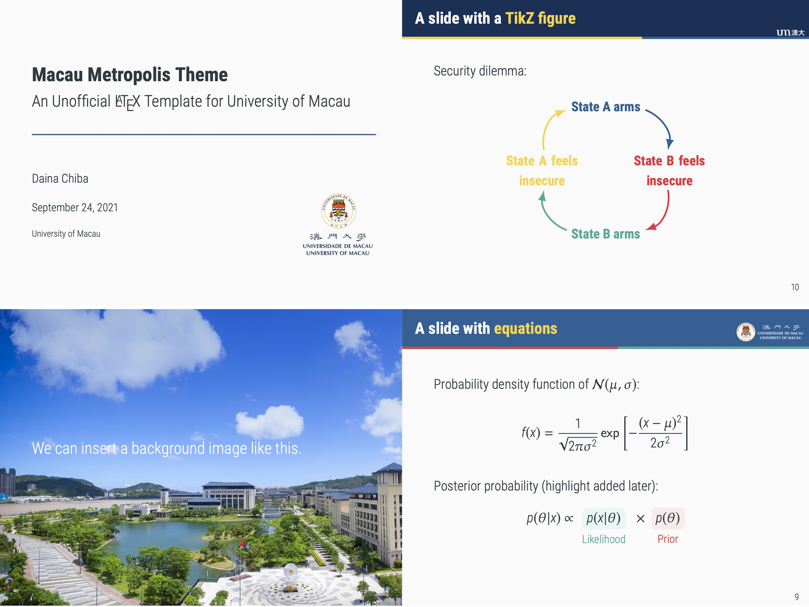

# MacauMetropolis

**Version 0.01 uploaded**

# An Unofficial LaTeX Beamer style file for University of Macau

**Daina Chiba**, Associate Professor of Political Science, *University of Macau*

This is an *unofficial* LaTeX Beamer theme for University of Macau. 

## Update

Version 0.01 was uploaded on September 25, 2021.

## Usage
Download one or both of the teplate files (``main_UMLightBlue.tex`` or ``main_UMBlue.tex``; these two files differ only in colors), the style file ``MacauMetropolis.sty``, and the **figures** folder (along with its contents). Place all these files and folders in one directory. 

I do not have the rights to distribute University of Macau's logo and icon files, so these files are not included in the package. You need to download these files directly from University of Macau's [identity website](https://identity.co.um.edu.mo/) (internal access only). I suggest you download all the ``.png`` files from the [logo page](https://identity.co.um.edu.mo/university-logo/) and [icon page](https://identity.co.um.edu.mo/university-icon/), and place them in the **figures** sub-folder under the current directory. To download campus pictures, please go to another [identity webpage](https://www.um.edu.mo/about-um/identity/) (public access) by the University of Macau and click on the ``Desktop Wallpapers`` link. Move the downloaded .zip file to the **figures** directory and extract it there, so that you will have ``figures/Desktop-Wallpapers/Desktop Wallpaper (ver 1).jpg``. 

Once you have all the files, you can typeset ``main_UM*.tex`` using XeLaTeX to produce presentation slides (``main_UM*.pdf``).

